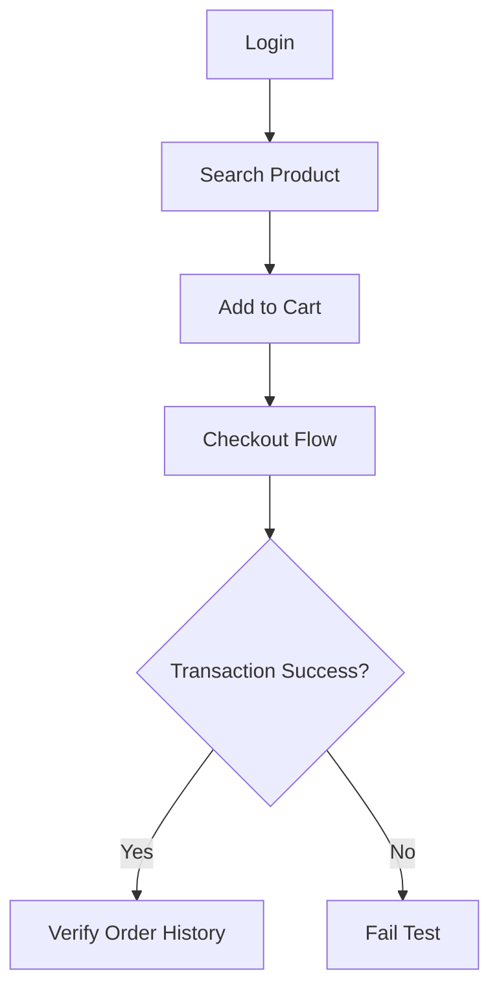

# 🚀 E-Commerce Performance Engineering: End-to-End Simulation


## 🎯 Overview

This repository hosts a robust performance testing suite designed to simulate high-load user journeys on a standard .NET-based e-commerce platform ([Tricentis Demo Web Shop](https://demowebshop.tricentis.com/)).

The primary goal of this project is to demonstrate **advanced scripting techniques in Apache JMeter**, focusing on dynamic data correlation, session management, and resilient transaction handling within a complex "One Page Checkout" architecture.

---

## 🐳 Run with Docker

To ensure environment consistency and simplify execution, the project includes a `docker-compose.yml` that uses the official [`justb4/jmeter`](https://hub.docker.com/r/justb4/jmeter) image.

### ✅ Quick Start

```bash
# 1. Clean previous results (optional but recommended)
rm -rf results/

# 2. Run the test in headless mode
docker compose up --build

# 3. View the interactive HTML report
open results/html-report/index.html
```

> 🔗 **[📊 Open Latest HTML Report](results/html-report/index.html)** *(after execution)*

The report includes:
- Response times (p90, p95, p99)
- Throughput (requests/sec)
- Error rates
- Time vs. Threads chart
- Active threads over time

> 💡 **Tip**: The `results/` folder is git-ignored — reports are ephemeral and generated on-demand.

---

## 🏗️ Architecture & Features

Unlike simple record-and-playback scripts, this solution implements a software engineering approach to performance testing:

* **Dynamic Correlation (CSRF Protection):** Implements **CSS Selectors** to extract `__RequestVerificationToken` and session cookies in real-time, ensuring scripts work across different environments and user sessions.
* **Data-Driven Testing:** Decouples test logic from test data using external CSV files (`credenciais.csv`) to simulate thousands of unique users concurrently.
* **Robust Checkout Logic:** Handles complex server-side logic where Shipping addresses must be explicitly provided or inherited from Billing, avoiding common "silent failures" in checkout flows.
* **Dynamic Product Selection:** Uses **Regex Extractors** to identify and select random valid products from search results, preventing bottlenecks on single database rows (hotspots).
* **Business Logic Validation:** Implements **Response Assertions** at every critical step (e.g., verifying "Log out" presence, checking Order History for generated IDs) to avoid false positives (HTTP 200 OK on error pages).

## 🔄 User Journey Flow

The script models a full "Guest-to-Customer" conversion funnel:



1.  **Authentication:** Login with parameterized credentials.
2.  **Discovery:** Search for products (e.g., "Laptop") and parse dynamic IDs.
3.  **Cart Management:** Add items to the shopping cart.
4.  **Checkout Wizard:**
    * Accept Terms.
    * **Billing Address:** Data injection via HTTP POST.
    * **Shipping Address:** Logic to handle distinct or inherited addresses.
    * **Shipping & Payment Methods:** Selection (e.g., Ground / COD).
    * **Confirmation:** Finalizing the order.
5.  **Validation:** Extracting the generated **Order ID** from the customer's order history to ensure database persistence.

## 📂 Project Structure

```text
├── docker-compose.yml                # 🐳 Containerized execution
├── tests/
│   └── jmeter/
│       ├── Demo-Shop-Performance-Test.jmx   # Main Test Plan
│       └── credenciais.csv                  # Test data (fake credentials)
├── results/                        # 📊 Output folder (git-ignored)
│   └── html-report/                # 🖼️ Auto-generated dashboard
│       └── index.html              # 🔗 [📊 Open Latest HTML Report]
├── docs/
│   └── architecture_diagram.png
└── README.md
```

## ⚙️ Prerequisites

* **Docker & Docker Compose** *(recommended)*
  → No need to install Java or JMeter locally.
* **OR** manually: Java 8+, JMeter 5.6.3+

## 🚀 How to Run

### Option 1: 🐳 Docker (Cross-Platform, Isolated)

```bash
docker compose up --build
```

➡️ Results: `results/result.jtl` + `results/html-report/index.html`

### Option 2: CLI (Local JMeter)

```bash
jmeter -n \
  -t tests/jmeter/Demo-Shop-Performance-Test.jmx \
  -l results/result.jtl \
  -e -o results/html-report
```

---

## 📊 Performance Metrics Strategy

The test plan is configured to calculate throughput based on Little's Law, supporting three load scenarios:

* **Smoke Test:** Validation of script logic (1-5 users).
* **Load Test:** 1,000 orders/hour to measure baseline latency.
* **Stress Test:** 100,000 orders/4 hours to identify breaking points and database locks.


## ⚡ Alternative: Run with k6 (TypeScript + Webpack)

Alongside JMeter, this project features a modern **[k6](https://k6.io/)** implementation built with TypeScript and Webpack. This approach champions modularity and Developer Experience (DX), serving as a blueprint for migrating legacy scripts to code-based performance testing.

> ✅ **Key Benefits:**
>
>   * **Code Reusability:** Modular logic using imports (e.g., `utils/extraction.ts`).
>   * **Type Safety:** Full TypeScript support via `@types/k6`.
>   * **Zero Runtime Deps:** Webpack bundles everything into a single file.
>   * **Migration Path:** A reference implementation for moving from JMeter to k6.

### 📁 k6 Project Structure

```text
tests/k6/
├── src/
│   ├── entrypoint.ts        # 🎯 Main entry point
│   └── utils/
│       └── extraction.ts    # 🧰 Utility functions (CSRF, regex logic)
├── webpack.config.js        # 📦 Bundles TS → dist/main.js
├── tsconfig.json
├── package.json
└── dist/
    └── main.js              # ⚙️ Generated bundle (executed by k6)
```

### ▶️ Local Execution

**Prerequisites:**

  * Node.js ≥ 18
  * `k6` CLI installed ([Installation Guide](https://k6.io/docs/getting-started/installation/))
  * Verify with: `k6 version`

```bash
# 1. Navigate to the k6 directory
cd tests/k6

# 2. Install dev dependencies (k6 runs pure JS, npm is for dev/build only)
npm install

# 3. Build with Webpack → generates ./dist/main.js
npm run pretest

# 4. Run the test
npm test              # Equivalent to: k6 run dist/main.js
# OR, build and run in one step:
npm start
```

#### 📝 NPM Scripts

| Script    | Command                       | Description                                   |
| :-------- | :---------------------------- | :-------------------------------------------- |
| `pretest` | `webpack`                     | Compiles `src/entrypoint.ts` → `dist/main.js` |
| `test`    | `k6 run dist/main.js`         | Executes the compiled bundle                  |
| `start`   | `npm run pretest && npm test` | Builds and runs immediately                   |

> ⚠️ **Important:** k6 does **not** execute TypeScript natively. Webpack is required to transpile and bundle the code into a k6-compatible format before execution.

-----

### 🐳 Run with Docker (CI/CD Ready)

For Continuous Integration pipelines (e.g., GitHub Actions), use the following workflow to ensure a clean build environment:

1.  **Install:** `cd tests/k6 && npm ci`
2.  **Build:** `npm run pretest` (Generates `dist/main.js`)
3.  **Run:** `docker compose run --rm k6`
	🕵️ **Verify Execution:** If running in background or debugging, track progress with:
	```bash
	docker logs -f k6_runner
	# OR if using service name:
	docker compose logs -f k6
	```

## 🔮 Future Improvements

* **Hybrid Reporting:** Merge JMeter and k6 metrics into a single Grafana dashboard
* **Frontend Performance:** Integrating **Playwright** to measure "Largest Contentful Paint" (LCP) and "Time to Interactive" (TTI) alongside backend stress.
* **CI/CD Pipeline:** GitHub Actions workflow to trigger smoke tests on every PR → auto-publish report as artifact.

---
*Author: Luis Fernando Richter*
